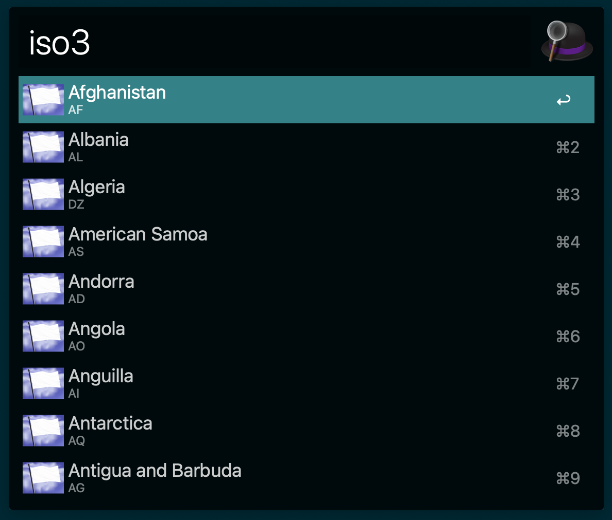

# Alfred ISO3 Code Searcher Worflow

---

## Requirements

1. [Alfred App v4](http://www.alfredapp.com/#download)
1. [Alfred Powerpack](https://buy.alfredapp.com/)

## Installing

1. [Click to download](https://raw.github.com/adrianolisboa/alfred-iso3-code-searcher/main/iso3-code-searcher.alfredworkflow)
1. Double-click to import into Alfred

## Commands

- `iso3 {query}`

## About

Alfred App Workflow that allows user to search for ISO3 country codes

